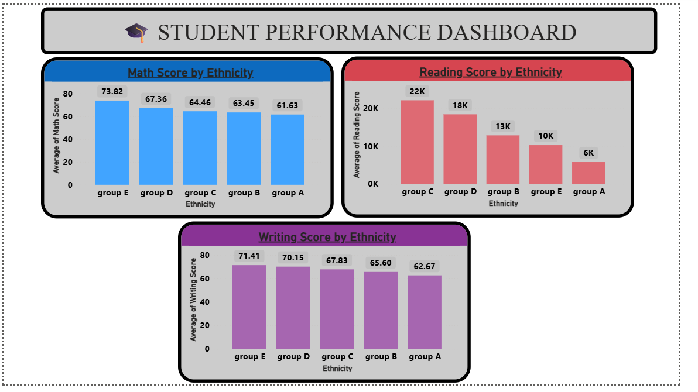

# 🎓 Student Performance Analysis

## 📌 Project Overview
This project analyzes student performance data to understand how factors such as **parental education, test preparation, lunch type, and demographics** influence academic outcomes in Math, Reading, and Writing.  

---

## 🔑 Analysis Highlights
- **Overall Scores** summarized into key performance indicators.  
- **Demographic Breakdown**:
  - Math, Reading, and Writing scores by **Ethnicity**  
  - Overall Score by **Parental Education**  
  - Overall Score by **Test Preparation**  
  - Overall Score by **Lunch Type**  
- **Interactive exploration** using filters for Lunch, Ethnicity, and Parental Education.  

---

## 📊 Key Insights
- Students with **standard lunch** scored ~8 points higher on average compared to free/reduced lunch.  
- Students who **completed test preparation** scored ~8 points higher than those who didn’t.  
- **Parental education** strongly correlates with performance: students with parents holding a Master’s degree scored ~11 points higher than those with only high school education.  
- **Ethnicity patterns** show Group E consistently performing at the top across all subjects.  

---

## 📂 Files
- `dashboard.pbix` → Interactive report file  
- `dashboard.pdf` → Exported version for quick preview  
- `screenshots/` → Visual examples from the analysis  
- `StudentsPerformance.xlsx` → Dataset  

---

## 📷 Dashboard Views
| Math, Reading, Writing by Ethnicity | Lunch & Parental Education Impact | KPI Cards & Test Preparation |
|------------------------------------|-----------------------------------|------------------------------|
|  |  |  |

---

## 🧭 Summary
This project demonstrates how **socio-economic and demographic factors** shape student academic outcomes.  
The analysis highlights measurable gaps and patterns that can guide **data-driven decision making** in the education sector.
